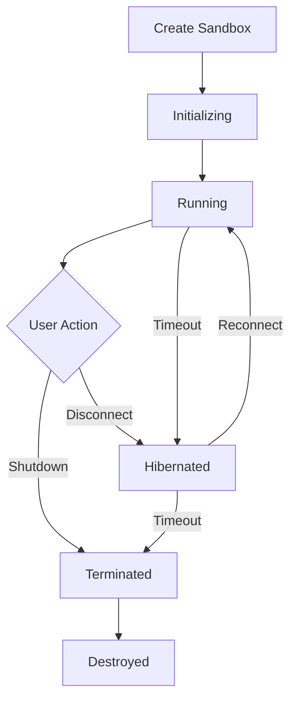

# Sandbox Lifecycle

Understanding the complete lifecycle of a CodeSandbox sandbox from creation to cleanup.

## Lifecycle Overview



## Creation Phase

### Basic Creation

```javascript
import { CodeSandbox } from "@codesandbox/sdk";

const sdk = new CodeSandbox(process.env.CSB_API_KEY);

// Create a new sandbox
const sandbox = await sdk.sandboxes.create({
  title: "My Development Environment",
  // Optional: specify template, VM tier, etc.
});

console.log(`Created sandbox: ${sandbox.id}`);
```

### Advanced Creation Options

```javascript
const sandbox = await sdk.sandboxes.create({
  title: "Full-Stack App",
  vmTier: "SMALL", // More resources
  source: {
    type: "git",
    url: "https://github.com/user/repo.git",
    branch: "main"
  },
  // Environment setup
  environment: {
    NODE_ENV: "development"
  }
});
```

## Initialization Phase

After creation, the sandbox goes through initialization:

```javascript
const client = await sandbox.connect();

// Monitor initialization progress
client.setup.onSetupProgressUpdate((progress) => {
  console.log(`Setup progress: ${progress.completed}/${progress.total}`);
  
  progress.steps.forEach(step => {
    console.log(`${step.name}: ${step.status}`);
  });
});

// Wait for setup to complete
await client.setup.waitForCompletion();
console.log("Sandbox is ready!");
```

## Active Phase

### Connection Management

```javascript
// Connect to the sandbox
const client = await sandbox.connect();

// Monitor connection state
client.onStateChange((state) => {
  console.log(`Connection state: ${state}`);
  // States: "CONNECTED", "DISCONNECTED", "HIBERNATED"
});

// Check if sandbox agent is up to date
if (!client.isUpToDate) {
  console.log("Sandbox agent needs update - restart recommended");
}
```

### Keep-Alive Management

```javascript
// Prevent automatic hibernation
client.keepActiveWhileConnected(true);

// The sandbox will stay active as long as the client is connected
// Automatically sends keep-alive signals every 10 seconds

// Disable keep-alive (allow hibernation)
client.keepActiveWhileConnected(false);
```

## Hibernation

### Automatic Hibernation

Sandboxes automatically hibernate after a period of inactivity:

- **Default timeout**: 30 minutes of inactivity
- **Configurable**: Can be adjusted per sandbox
- **State preservation**: All files and processes are preserved

### Manual Hibernation

```javascript
// Gracefully disconnect
await client.disconnect();

// Hibernate the sandbox
await sandbox.hibernate();

console.log("Sandbox hibernated - resources freed but state preserved");
```

### Resuming from Hibernation

```javascript
// Resume a hibernated sandbox
const client = await sandbox.connect();

// The sandbox will wake up and restore its previous state
// Files, environment variables, and process state are preserved
console.log("Sandbox resumed from hibernation");
```

## Reconnection Handling

### Automatic Reconnection

The SDK handles reconnection automatically:

```javascript
const client = await sandbox.connect();

// Automatic reconnection on network issues
client.onStateChange((state) => {
  if (state === "DISCONNECTED") {
    console.log("Connection lost - attempting to reconnect...");
  } else if (state === "CONNECTED") {
    console.log("Reconnected successfully!");
  }
});
```

### Manual Reconnection

```javascript
try {
  await client.reconnect();
  console.log("Manual reconnection successful");
} catch (error) {
  console.error("Reconnection failed:", error);
}
```

### Browser-Specific Reconnection

In browsers, reconnection happens automatically when the tab regains focus:

```javascript
import { connectToSandbox } from "@codesandbox/sdk/browser";

const client = await connectToSandbox({
  session: sandboxSession,
  getSession: async (id) => await resumeSandbox(id),
  // Automatic reconnection on focus
  onFocusChange: (notify) => {
    const listener = () => notify(document.hasFocus());
    window.addEventListener("visibilitychange", listener);
    return () => window.removeEventListener("visibilitychange", listener);
  }
});
```

## Shutdown and Cleanup

### Graceful Shutdown

```javascript
// Disconnect the client first
await client.disconnect();

// Shutdown the sandbox (permanent)
await sandbox.shutdown();

console.log("Sandbox shut down - all resources freed");
```

### Resource Cleanup

```javascript
// Always dispose of clients when done
client.dispose();

// This will:
// - Close all WebSocket connections
// - Clean up event listeners
// - Free memory resources
```

### Bulk Operations

```javascript
// Shutdown multiple sandboxes
const sandboxes = await sdk.sandboxes.list({ status: "running" });

for (const sandbox of sandboxes) {
  await sandbox.shutdown();
}

console.log(`Shut down ${sandboxes.length} sandboxes`);
```

## Error Handling Throughout Lifecycle

### Connection Errors

```javascript
try {
  const client = await sandbox.connect();
} catch (error) {
  if (error.code === "SANDBOX_NOT_FOUND") {
    console.error("Sandbox was deleted");
  } else if (error.code === "CONNECTION_TIMEOUT") {
    console.error("Connection timed out - sandbox may be starting");
  } else {
    console.error("Connection failed:", error.message);
  }
}
```

### Operation Errors

```javascript
client.onStateChange((state) => {
  if (state === "HIBERNATED") {
    console.log("Sandbox hibernated - operations will fail until reconnected");
  }
});

try {
  await client.commands.run("echo 'test'");
} catch (error) {
  if (client.state === "HIBERNATED") {
    console.log("Reconnecting hibernated sandbox...");
    await client.reconnect();
    // Retry the operation
    await client.commands.run("echo 'test'");
  }
}
```

## Lifecycle Best Practices

### 1. Always Handle State Changes

```javascript
const client = await sandbox.connect();

client.onStateChange((state) => {
  switch (state) {
    case "CONNECTED":
      console.log("Ready for operations");
      break;
    case "DISCONNECTED":
      console.log("Connection lost - operations will fail");
      break;
    case "HIBERNATED":
      console.log("Sandbox hibernated - call reconnect() to resume");
      break;
  }
});
```

### 2. Implement Retry Logic

```javascript
async function runCommandWithRetry(client, command, maxRetries = 3) {
  for (let i = 0; i < maxRetries; i++) {
    try {
      if (client.state === "HIBERNATED") {
        await client.reconnect();
      }
      return await client.commands.run(command);
    } catch (error) {
      if (i === maxRetries - 1) throw error;
      await new Promise(resolve => setTimeout(resolve, 1000 * (i + 1)));
    }
  }
}
```

### 3. Clean Up Resources

```javascript
// Use try/finally to ensure cleanup
let client;
try {
  client = await sandbox.connect();
  await client.commands.run("npm install");
  // ... other operations
} finally {
  if (client) {
    await client.disconnect();
    client.dispose();
  }
}
```

## Next Steps

- Learn about [VM Tiers & Resources](/guides/core-concepts/vm-tiers)
- Explore [Basic Operations](/guides/sdk-usage/basic-operations)
- Check out [Error Handling](/guides/best-practices/error-handling) best practices
